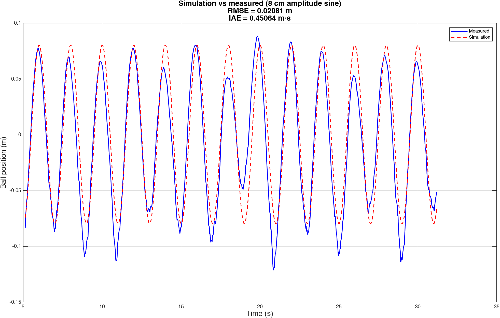
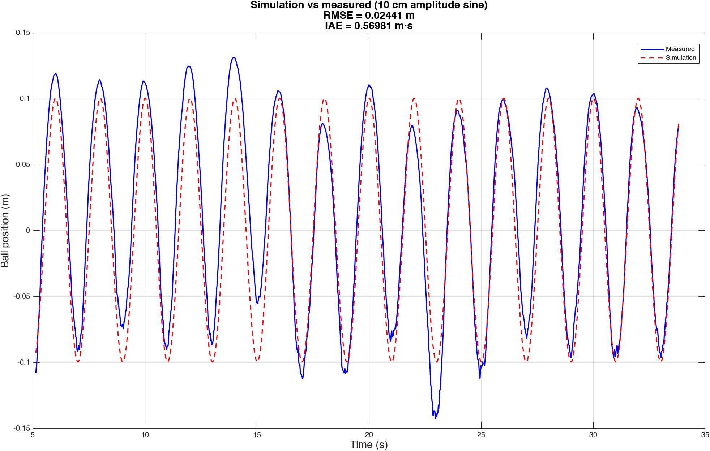
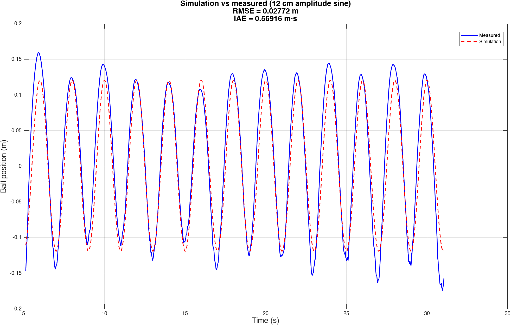

# Figures — Simulation vs. Measured

Overlay plots comparing **simulation** (red dashed) vs **measured** (blue) ball position for sine references at different amplitudes. Units: **m** and **s**. Right is **positive**; origin at beam **center**.

* Data source: CSVs in [`data/`](../data) captured on **ESP32 (Feedback Linearization)** with **VL53L0X**.
* Metrics (RMSE, IAE) computed with [`scripts/compute_metrics.m`](../scripts/compute_metrics.m).

## Summary

| Case       | CSV               | Sine amplitude |    RMSE (m) |   IAE (m·s) | Figure                                |
| ---------- | ----------------- | -------------: | ----------: | ----------: | ------------------------------------- |
| Sine 8 cm  | `data/sin_08.csv` |           0.08 | **0.02081** | **0.45064** | `simulation_vs_measured_sine08cm.png` |
| Sine 10 cm | `data/sin_10.csv` |           0.10 | **0.02441** | **0.56981** | `simulation_vs_measured_sine10cm.png` |
| Sine 12 cm | `data/sin_12.csv` |           0.12 | **0.02772** | **0.56916** | `simulation_vs_measured_sine12cm.png` |

---

## Figures

### Sine — 8 cm amplitude



* **RMSE = 0.02081 m**, **IAE = 0.45064 m·s**.
* Blue: measured position (VL53L0X). Red dashed: simulation output.
* CSV: `data/sin_08.csv`.

### Sine — 10 cm amplitude



* **RMSE = 0.02441 m**, **IAE = 0.56981 m·s**.
* CSV: `data/sin_10.csv`.

### Sine — 12 cm amplitude



* **RMSE = 0.02772 m**, **IAE = 0.56916 m·s**.
* CSV: `data/sin_12.csv`.

---

## Reproducing

1. Run the Simulink model to generate simulated reference/position and log them to workspace (e.g., `r_sim`, `y_sim`, *Structure with time*).
2. Use `scripts/compute_metrics.m` to align the time bases, interpolate simulation to the measured timeline, and compute RMSE/IAE.

Example snippet (MATLAB):

```matlab
% Load measured data
T = readmatrix('data/sin_12.csv'); t_real = T(:,1); y_real = T(:,2);
% Use your logged sim variables (Structure with time)
S = compute_metrics(t_real, y_real, y_sim.time, y_sim.signals.values, ...
                    struct('idx_start',1,'lag_sec',0,'label','sine 12cm'));
```

